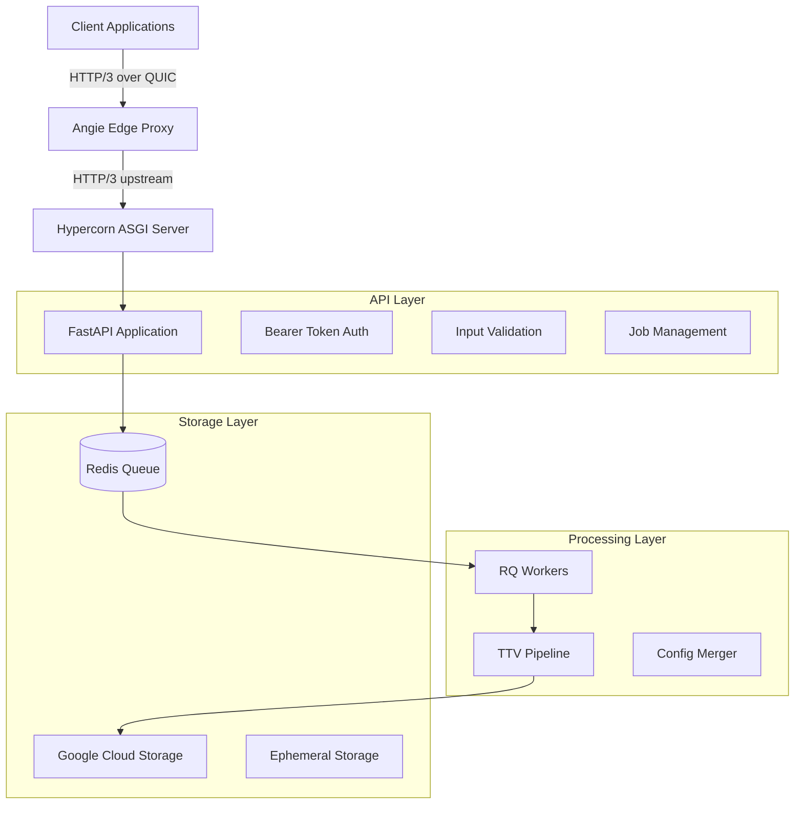
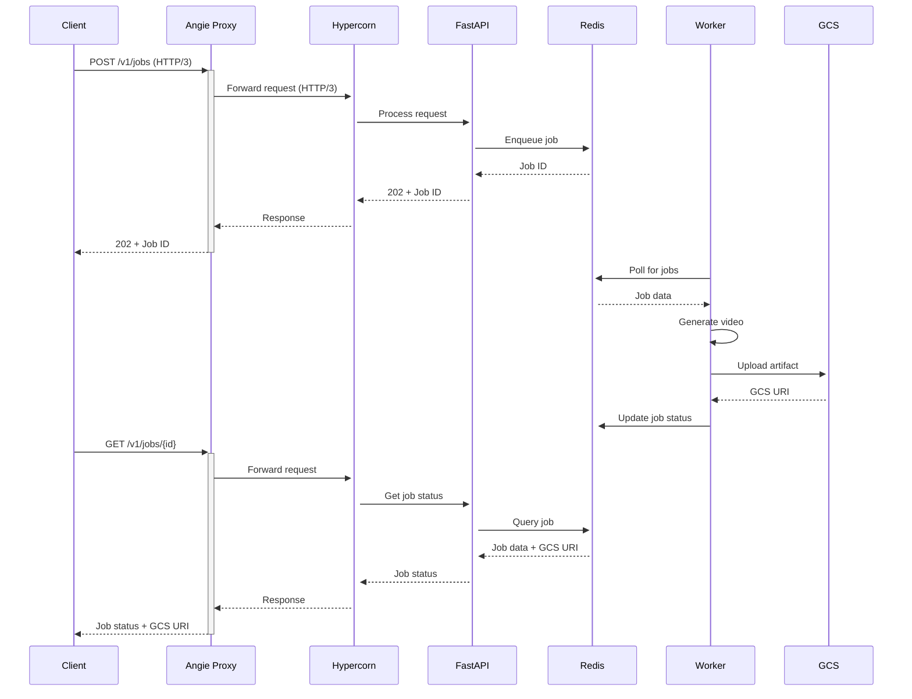

# Design Document

## Overview

The API server exposes the existing ttv-pipeline as a REST service with HTTP/3 end-to-end support. The architecture follows a microservices pattern with clear separation between the API layer, job orchestration, and video generation workers. The system uses Angie as an edge proxy with HTTP/3 support, Hypercorn as the ASGI application server, and Redis/RQ for job queuing.

The design prioritizes:
- **Immediate response**: Jobs are accepted immediately and processed asynchronously
- **HTTP/3 performance**: Full QUIC pipeline from client to application server
- **Structured concurrency**: Trio-first approach with proper cancellation semantics
- **Configuration reuse**: Leverages existing pipeline configuration without introducing new environment variables
- **Prompt override parity**: HTTP prompts follow the same precedence rules as CLI arguments

## Architecture

### System Components



### Network Architecture



## Components and Interfaces

### API Layer (FastAPI Application)

**Core Modules:**
- `api/main.py`: FastAPI application setup and configuration
- `api/routes/jobs.py`: Job management endpoints
- `api/routes/health.py`: Health and monitoring endpoints
- `api/models.py`: Pydantic models for request/response validation
- `api/exceptions.py`: Custom exception handlers
- `api/middleware.py`: Security and logging middleware

**Key Interfaces:**
```python
# Job creation request
class JobCreateRequest(BaseModel):
    prompt: str = Field(..., min_length=1, max_length=2000)

# Job status response
class JobStatusResponse(BaseModel):
    id: str
    status: JobStatus
    progress: int
    created_at: datetime
    started_at: Optional[datetime]
    finished_at: Optional[datetime]
    gcs_uri: Optional[str]
    error: Optional[str]

# Artifact URL response
class ArtifactResponse(BaseModel):
    gcs_uri: str
    url: str
    expires_in: int
```

### Job Orchestration Layer

**Queue Management:**
- Uses Redis with RQ (Redis Queue) for job management
- Job states: `queued`, `started`, `progress`, `finished`, `failed`, `canceled`
- Structured job metadata with timestamps and progress tracking

**Configuration Merger:**
```python
class ConfigMerger:
    def build_effective_config(
        self, 
        base_config: Dict, 
        cli_args: Optional[Dict] = None,
        http_overrides: Optional[Dict] = None
    ) -> Dict:
        """Build effective configuration with proper precedence"""
        # Precedence: HTTP > CLI > config
```

### Worker Layer

**Job Processing:**
- `workers/video_worker.py`: Main worker implementation using RQ
- `workers/pipeline_executor.py`: Pipeline execution with structured concurrency
- `workers/gcs_uploader.py`: Artifact upload to Google Cloud Storage
- `workers/progress_tracker.py`: Progress reporting and log streaming

**Cancellation Handling:**
```python
class PipelineExecutor:
    async def execute_with_cancellation(
        self, 
        config: Dict, 
        cancellation_token: trio.CancelledError
    ) -> str:
        """Execute pipeline with cooperative cancellation"""
```

### Storage Integration

**Google Cloud Storage:**
- Artifact path: `gs://{bucket}/{prefix}/{YYYY-MM}/{job_id}/final_video.mp4`
- Uses existing GCS credentials from pipeline configuration
- On-demand signed URL generation with configurable expiration
- Automatic bucket creation and lifecycle management

**Redis Schema:**
```python
# Job metadata structure
job_data = {
    "id": "job_123",
    "status": "progress",
    "progress": 45,
    "created_at": "2025-08-31T12:34:56Z",
    "started_at": "2025-08-31T12:35:10Z",
    "finished_at": None,
    "prompt": "A man stands at a podium...",
    "config": {...},  # Effective configuration
    "gcs_uri": None,
    "error": None,
    "logs": ["Starting generation...", "Keyframes created..."]
}
```

## Data Models

### Request/Response Models

```python
# Pydantic models for API validation
class JobCreateRequest(BaseModel):
    prompt: str = Field(
        ..., 
        min_length=1, 
        max_length=2000,
        description="Text prompt for video generation"
    )

class JobStatusResponse(BaseModel):
    id: str
    status: Literal["queued", "started", "progress", "finished", "failed", "canceled"]
    progress: int = Field(ge=0, le=100)
    created_at: datetime
    started_at: Optional[datetime] = None
    finished_at: Optional[datetime] = None
    gcs_uri: Optional[str] = None
    error: Optional[str] = None

class ArtifactResponse(BaseModel):
    gcs_uri: str
    url: str = Field(description="Signed HTTPS URL for download")
    expires_in: int = Field(description="URL expiration in seconds")

class LogsResponse(BaseModel):
    lines: List[str] = Field(description="Recent log lines")
```

### Configuration Models

```python
class APIConfig(BaseModel):
    """API server configuration"""
    host: str = "0.0.0.0"
    port: int = 8000
    quic_port: int = 8443
    workers: int = 2
    auth_token: str
    cors_origins: List[str] = ["*"]
    
class GCSConfig(BaseModel):
    """Google Cloud Storage configuration"""
    bucket: str
    prefix: str = "ttv-api"
    credentials_path: str
    signed_url_expiration: int = 3600
```

## Error Handling

### Exception Hierarchy

```python
class APIException(Exception):
    """Base API exception"""
    def __init__(self, message: str, status_code: int = 500):
        self.message = message
        self.status_code = status_code

class ValidationError(APIException):
    """Input validation error"""
    def __init__(self, message: str):
        super().__init__(message, 400)

class RateLimitError(APIException):
    """Rate limit exceeded error"""
    def __init__(self, message: str = "Rate limit exceeded"):
        super().__init__(message, 429)

class JobNotFoundError(APIException):
    """Job not found error"""
    def __init__(self, job_id: str):
        super().__init__(f"Job {job_id} not found", 404)

class ArtifactNotReadyError(APIException):
    """Artifact not ready error"""
    def __init__(self, job_id: str):
        super().__init__(f"Artifact for job {job_id} not ready", 404)
```

### Error Response Format

```python
class ErrorResponse(BaseModel):
    error: str
    message: str
    details: Optional[Dict[str, Any]] = None
    timestamp: datetime
    request_id: str
```

## Testing Strategy

### Unit Tests
- **API endpoints**: Request/response validation, authentication, error handling
- **Configuration merger**: Precedence rules, validation, edge cases
- **Job management**: State transitions, progress tracking, cancellation
- **GCS integration**: Upload/download, signed URL generation, error handling

### Integration Tests
- **End-to-end job flow**: Submit → process → complete → retrieve
- **HTTP/3 validation**: Protocol negotiation, performance characteristics
- **Cancellation scenarios**: Graceful shutdown, resource cleanup
- **Error scenarios**: API failures, timeout handling, fallback behavior

### Load Tests
- **Concurrent job submission**: Queue saturation, back-pressure handling
- **HTTP/3 performance**: Throughput comparison with HTTP/2
- **Resource utilization**: Memory usage, connection pooling, worker scaling

### Contract Tests
```python
def test_job_creation_contract():
    """Test job creation follows API contract"""
    response = client.post("/v1/jobs", json={"prompt": "test prompt"})
    assert response.status_code == 202
    assert "id" in response.json()
    assert "Location" in response.headers

def test_prompt_override_parity():
    """Test HTTP prompt override matches CLI behavior"""
    # Test various precedence scenarios
    config = load_test_config()
    
    # HTTP > CLI > config
    effective = build_effective_config(
        config, 
        cli_args={"prompt": "cli_prompt"},
        http_overrides={"prompt": "http_prompt"}
    )
    assert effective["prompt"] == "http_prompt"
```

## Security Considerations

### Internal Network Security
- CORS configuration for internal network access
- Rate limiting at edge proxy level (Angie configuration) 
- Optional IP allowlisting at network level for additional security
- Security headers appropriate for internal microservices

### Data Protection
- Secure credential management for GCS access
- Log sanitization to prevent credential leakage
- Signed URL parameter redaction in logs
- Proper handling of temporary files and cleanup

### Transport Security
- TLS 1.3 for all encrypted connections
- HTTP/3 over QUIC with proper certificate validation
- Header preservation for tracing and security (X-Forwarded-For, etc.)
- CORS configuration for cross-origin requests

## Deployment Architecture

### Container Strategy
```dockerfile
# Multi-stage build for API server
FROM python:3.11-slim as base
# Install dependencies, copy code

FROM base as api
EXPOSE 8000 8443
CMD ["hypercorn", "api:app", "--bind", "0.0.0.0:8000", "--quic-bind", "0.0.0.0:8443"]

FROM base as worker  
CMD ["rq", "worker", "--url", "redis://redis:6379"]
```

### Service Composition
```yaml
# docker-compose.yml structure
services:
  angie:
    # Edge proxy with HTTP/3 support
    ports: ["443:443/tcp", "443:443/udp"]
    
  api:
    # FastAPI application server
    ports: ["8000:8000", "8443:8443/udp"]
    
  worker:
    # RQ workers for job processing
    scale: 2
    
  redis:
    # Job queue and metadata storage
    
  # Optional: separate GPU workers
  gpu-worker:
    runtime: nvidia
    scale: 1
```

### Configuration Management
- Environment-specific configuration files
- Secret management via mounted volumes or secret stores
- Configuration validation on startup
- Hot-reload capability for non-critical settings

## Performance Considerations

### HTTP/3 Optimization
- Connection pooling and keep-alive settings
- QUIC parameter tuning for video workloads
- Fallback path optimization for HTTP/2/1.1
- Alt-Svc header configuration for protocol negotiation

### Concurrency & Scaling
- Trio-based structured concurrency for I/O operations
- Worker auto-scaling based on queue depth
- Connection pooling for Redis and GCS
- Graceful shutdown with job completion

### Resource Management
- Memory limits for video processing workers
- Disk space management for temporary files
- GPU allocation and scheduling
- Network bandwidth considerations for large video uploads

## Monitoring & Observability

### Metrics Collection
```python
# Key metrics to track
metrics = {
    "api_requests_total": Counter,
    "api_request_duration": Histogram,
    "job_queue_depth": Gauge,
    "job_processing_duration": Histogram,
    "gcs_upload_duration": Histogram,
    "active_connections": Gauge,
    "http3_connections_ratio": Gauge
}
```

### Structured Logging
```python
# Log format
log_entry = {
    "timestamp": "2025-08-31T12:34:56Z",
    "level": "INFO",
    "component": "api",
    "job_id": "job_123",
    "message": "Job processing started",
    "duration_ms": 150,
    "user_agent": "client/1.0",
    "request_id": "req_456"
}
```

### Health Checks
- `/healthz`: Basic liveness check
- `/readyz`: Readiness check including Redis connectivity
- `/metrics`: Prometheus-compatible metrics endpoint
- Custom health checks for GCS connectivity and worker availability