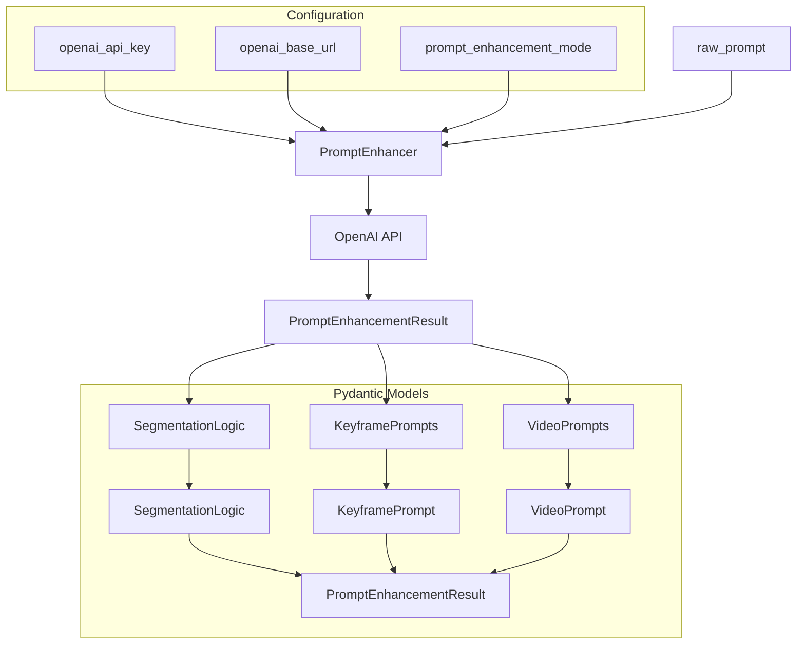
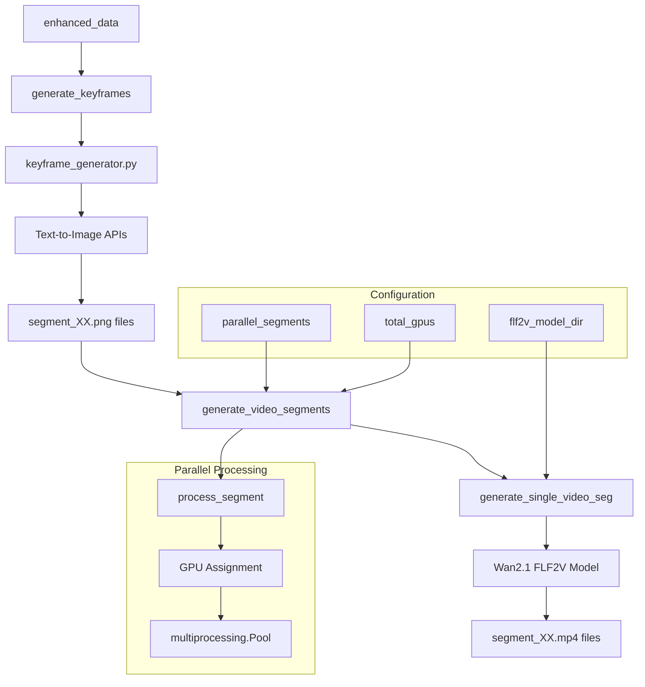
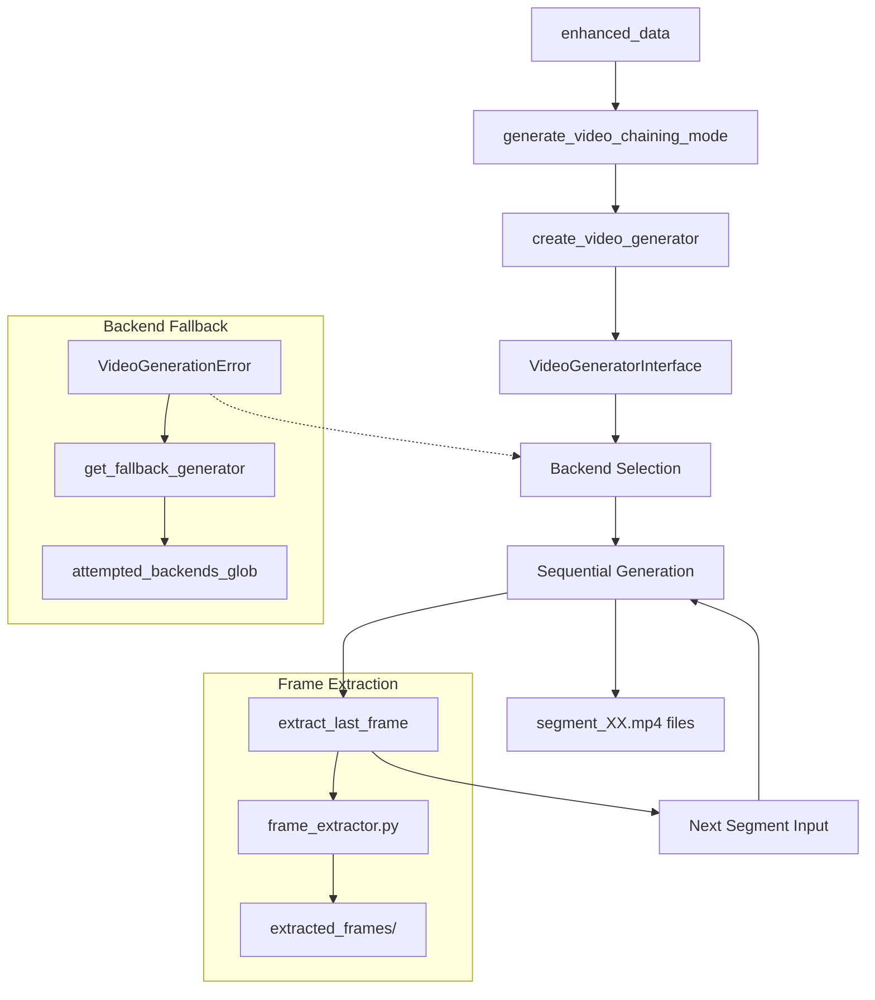
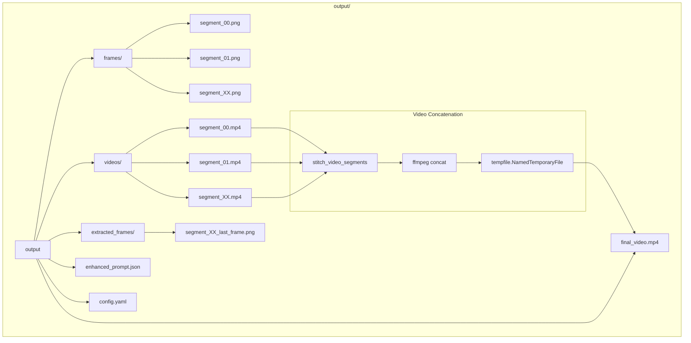

# Core Pipeline

*Source: [DeepWiki Analysis](https://deepwiki.com/trilogy-group/ttv-pipeline/3-core-pipeline)*

The Core Pipeline serves as the central orchestrator for the TTV (Text-to-Video) generation system. It coordinates the entire workflow from initial text prompt to final video output, managing prompt enhancement, keyframe generation, video segment creation, and final assembly.

**Key Source Files:**
- [`keyframe_generator.py`](../keyframe_generator.py) - Keyframe generation module
- [`pipeline.py`](../pipeline.py) - Main pipeline orchestration

## Purpose and Scope

The Core Pipeline serves as the central orchestrator for the TTV (Text-to-Video) generation system. It coordinates the entire workflow from initial text prompt to final video output, managing prompt enhancement, keyframe generation, video segment creation, and final assembly. This document covers the main pipeline logic, execution flow, and coordination mechanisms.

For information about specific video generation backends, see [Video Generation Backends](04-video-generation-backends.md). For deployment and containerization details, see [Deployment and Containers](08-deployment-and-containers.md).

## Pipeline Execution Flow

The core pipeline implements a sophisticated multi-stage workflow that transforms a single text prompt into a complete video through several coordinated phases.

### Main Execution Flow

*Source: [`pipeline.py`](../pipeline.py)*

The `run_pipeline()` function serves as the main entry point, coordinating all pipeline stages through a configuration-driven approach. The pipeline creates a structured output directory hierarchy and maintains clean separation between different processing stages.

**Key Function:** `run_pipeline()`

### Prompt Enhancement System

The prompt enhancement system uses structured output validation through the `instructor` library to ensure consistent JSON responses from OpenAI. The `PromptEnhancer` class wraps the OpenAI client and applies the `PROMPT_ENHANCEMENT_INSTRUCTIONS` template to break long prompts into manageable 5-second segments.

**Key Components:**
- `instructor` library for structured output validation
- `PromptEnhancer` class for OpenAI client wrapping
- `PROMPT_ENHANCEMENT_INSTRUCTIONS` template for prompt breaking

## Generation Modes

The pipeline supports two distinct generation modes, each optimized for different use cases and quality requirements.

### Keyframe Mode

Keyframe mode generates static endpoint images for each segment first, then creates videos between consecutive keyframes using the FLF2V (First-Last-Frame to Video) model. This approach enables parallel processing since each segment has predetermined start and end frames.

**Key Features:**
- **Parallel Processing**: Segments can be processed simultaneously
- **Predetermined Endpoints**: Clear start and end frames for each segment
- **FLF2V Model**: Specialized for interpolating between keyframes
- **High Quality**: Maintains visual consistency through keyframe anchors

**Implementation Functions:**
- Keyframe generation: [`pipeline.py`](../pipeline.py)
- Video interpolation: [`pipeline.py`](../pipeline.py)
- Orchestration: [`pipeline.py`](../pipeline.py)

### Chaining Mode

Chaining mode generates video segments sequentially, extracting the last frame of each segment to use as the starting frame for the next segment. This ensures visual continuity but requires sequential processing and includes sophisticated fallback mechanisms for backend failures.

**Key Features:**
- **Sequential Processing**: Each segment depends on the previous one
- **Frame Continuity**: Last frame becomes next segment's first frame
- **Fallback Mechanisms**: Handles backend failures gracefully
- **Visual Consistency**: Maintains smooth transitions between segments

**Implementation Functions:**
- Sequential generation: [`pipeline.py`](../pipeline.py)
- Frame extraction: [`pipeline.py`](../pipeline.py)

## Configuration Management

### Configuration Loading and Structure

The pipeline uses a comprehensive YAML-based configuration system that drives all aspects of operation, from backend selection to generation parameters.

**Key Configuration Areas:**
- **Backend Selection**: Choose between local and remote generation
- **Generation Mode**: Keyframe vs chaining mode selection
- **GPU Configuration**: Multi-GPU and parallel processing settings
- **API Settings**: Credentials and endpoints for remote services
- **Output Parameters**: Video quality, duration, and directory settings

## Error Handling and Fallback Mechanisms

### Backend Fallback System

The pipeline implements robust error handling with automatic fallback capabilities:

1. **Primary Backend Failure**: Automatically switches to configured fallback backend
2. **Retry Logic**: Configurable retry attempts for transient failures
3. **Graceful Degradation**: Continues processing with available backends
4. **Error Reporting**: Comprehensive logging and error reporting

## Output Management

### Directory Structure and File Management

The pipeline creates a structured output hierarchy for organized file management and video concatenation:

The pipeline maintains a clean separation between intermediate files and the final output:

**Key Features:**
- **Organized Structure**: Clear separation of different output types
- **Configuration Backup**: Preserves configuration used for reproducibility
- **Intermediate Files**: Maintains access to all generation stages
- **Final Assembly**: Automated concatenation into final video

## Integration Points

### With Video Generation Backends

The core pipeline integrates with the backend abstraction layer through:
- **Factory Pattern**: Dynamic backend instantiation
- **Interface Compliance**: Standardized method calls across backends
- **Configuration Passing**: Backend-specific settings transmission
- **Error Propagation**: Consistent error handling across backends

### With External Services

The pipeline coordinates with several external services:
- **OpenAI API**: Prompt enhancement and segmentation
- **Image Generation**: Keyframe creation via multiple providers
- **Video Generation**: Both local and remote video backends
- **FFmpeg**: Final video concatenation and processing

---

## Next Steps

- **Backend Details**: See [Video Generation Backends](04-video-generation-backends.md) for backend configuration
- **Architecture Deep Dive**: See [Architecture and Interface](05-architecture-and-interface.md) for implementation details
- **Local Setup**: See [Local Generators](06-local-generators.md) for GPU-based generation
- **Remote APIs**: See [Remote API Generators](07-remote-api-generators.md) for cloud generation
