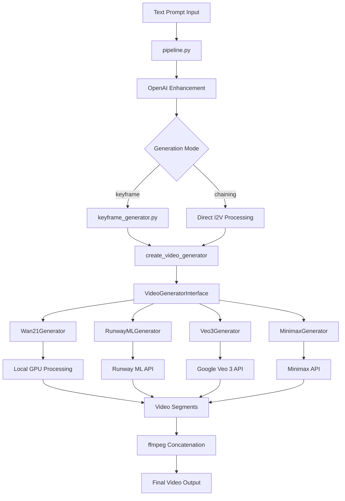
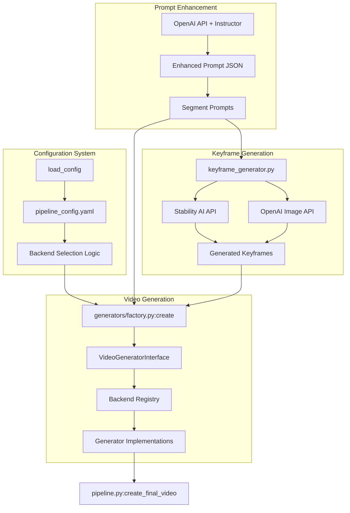
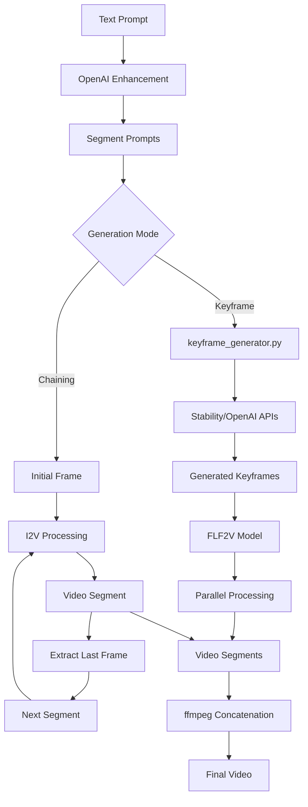

# Overview

*Source: [DeepWiki Analysis](https://deepwiki.com/trilogy-group/ttv-pipeline/1-overview)*

## System Purpose and Architecture

The TTV Pipeline solves the core challenge of generating long-form videos by breaking down complex prompts into manageable segments and supporting multiple generation backends including local GPU processing and cloud APIs. The system implements a clean abstraction layer that enables seamless switching between different video generation technologies.

## High-Level System Flow

The system components bridge between conceptual understanding and actual code implementation, enabling developers to easily locate and understand the implementation.

## Core Pipeline Components

The system is built around a modular architecture with clear separation of concerns between prompt processing, video generation, and output handling.

## Video Generation Backend Architecture

The system implements a sophisticated abstraction layer that supports multiple video generation backends through a unified interface, enabling seamless switching between local GPU processing and cloud APIs.

### Backend Abstraction and Factory Pattern

The backend architecture uses a factory pattern with actual class names and module structure:

## Generation Modes and Processing Flow

The system supports two distinct generation modes, each optimized for different use cases and processing requirements.

### Keyframe vs Chaining Mode Implementation

## Configuration-Driven Architecture

The entire system behavior is controlled through a comprehensive YAML configuration system that drives backend selection, generation parameters, and processing options.

### Key Configuration Parameters

**Backend Selection:**
- `default_backend`: Choose from `"wan2.1"`, `"runway"`, `"veo3"`, `"minimax"` - [`generators/factory.py`](../generators/factory.py)

**Backend-Specific Settings:**
- `wan2_dir`: Local Wan2.1 setup - [`generators/local/wan21_generator.py`](../generators/local/wan21_generator.py)
- `runway_ml`: Runway API configuration - [`generators/remote/runway_generator.py`](../generators/remote/runway_generator.py)
- `google_veo`: Veo3 API configuration - [`generators/remote/veo3_generator.py`](../generators/remote/veo3_generator.py)
- `minimax`: Minimax API configuration - [`generators/remote/minimax_generator.py`](../generators/remote/minimax_generator.py)

**Generation Control:**
- `generation_mode`: Choose `"keyframe"` or `"chaining"`
- `parallel_segments`: Enable parallel processing

### Configuration Loading and Processing

**Configuration System Implementation:**
- **Main Loading**: [`pipeline.py`](../pipeline.py)
- **Sample Configuration**: [`pipeline_config.yaml.sample`](../pipeline_config.yaml.sample)
- **Factory Processing**: [`generators/factory.py`](../generators/factory.py)

## Key Architectural Patterns

The system employs several key design patterns that enable flexibility, maintainability, and extensibility:

1. **Factory Pattern**: Abstracts backend creation and selection
2. **Interface Segregation**: Clear contracts for all video generators
3. **Configuration-Driven Design**: Runtime behavior controlled by YAML
4. **Fallback Mechanisms**: Automatic backend switching on failure
5. **Modular Architecture**: Clear separation of concerns across components

---

## Next Steps

- **Setup**: See [Getting Started](02-getting-started.md) for installation
- **Configuration**: See [Video Generation Backends](04-video-generation-backends.md) for backend setup
- **Architecture Details**: See [Architecture and Interface](05-architecture-and-interface.md) for implementation details
- **Deployment**: See [Deployment and Containers](08-deployment-and-containers.md) for production setup
