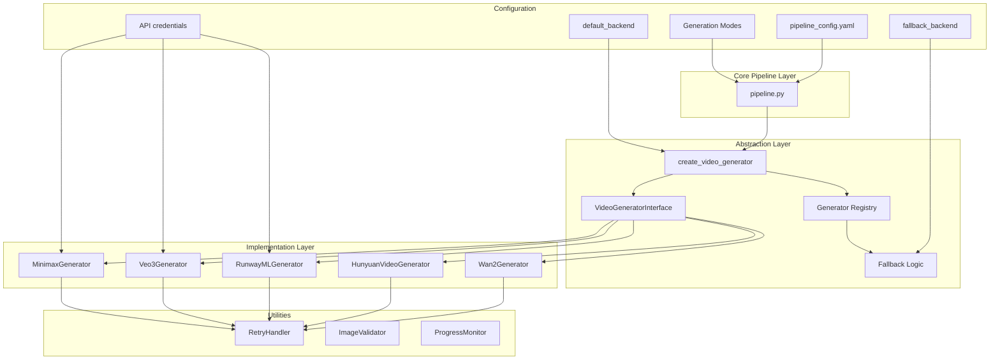

# Video Generation Backends

*Source: [DeepWiki Analysis](https://deepwiki.com/trilogy-group/ttv-pipeline/4-video-generation-backends)*

The video generation backends system provides a unified abstraction layer for multiple video generation technologies within the TTV Pipeline. This system enables seamless switching between local GPU-based models (such as Wan2.1) and remote cloud APIs (such as Runway ML, Google Veo 3, and Minimax) through a common interface and factory pattern.

**Key Source Files:**
- [`generators/__init__.py`](../generators/__init__.py) - Package exports and factory function
- [`generators/base.py`](../generators/base.py) - Base interface definition
- [`generators/factory.py`](../generators/factory.py) - Factory pattern implementation

## Purpose and Scope

The video generation backends system provides a unified abstraction layer for multiple video generation technologies within the TTV Pipeline. This system enables seamless switching between local GPU-based models (such as Wan2.1) and remote cloud APIs (such as Runway ML, Google Veo 3, and Minimax) through a common interface and factory pattern.

This document covers the overall backend architecture, interface design, and shared utilities. For detailed information about the interface design and factory implementation, see [Architecture and Interface](05-architecture-and-interface.md). For local GPU-based generation, see [Local Generators](06-local-generators.md). For cloud API integrations, see [Remote API Generators](07-remote-api-generators.md).

## Backend Architecture Overview

The video generation backend system implements a layered architecture that separates the core pipeline logic from specific generation implementations. This design enables the pipeline to support multiple generation technologies without coupling the core workflow to any particular backend.

### System Architecture



### Backend Selection Flow

The system uses a configuration-driven approach to select and instantiate the appropriate backend:

1. **Configuration Loading**: Read backend preferences from `pipeline_config.yaml`
2. **Factory Instantiation**: Use factory pattern to create backend instance
3. **Fallback Management**: Handle primary backend failures with automatic fallback
4. **Interface Compliance**: Ensure all backends implement the same interface

## Interface Design and Factory Pattern

### Core Interface Methods

The `VideoGeneratorInterface` defines the following essential methods that all backend implementations must provide:

- **`generate_video()`**: Core video generation method
- **`get_capabilities()`**: Returns backend capabilities and constraints
- **`estimate_cost()`**: Provides cost estimation for generation requests
- **`validate_inputs()`**: Validates input parameters before generation

### Factory Pattern Implementation

The factory pattern is implemented through the `create_video_generator` function exported by the generators package. This function encapsulates the logic for:

- **Reading backend configuration** from `pipeline_config.yaml`
- **Instantiating the appropriate generator class**
- **Handling fallback scenarios** when the primary backend fails
- **Managing API credentials** and initialization parameters

*Sources: [`generators/__init__.py`](../generators/__init__.py), [`generators/base.py`](../generators/base.py)*

## Configuration and Backend Selection

### Backend Configuration Schema

The configuration system supports multiple backend types with specific settings:

```yaml
# Default backend selection
default_backend: "wan2.1"  # Options: wan2.1, runway, veo3, auto

# Local backend configuration
wan2_dir: "./frameworks/Wan2.1"
models_dir: "./models"

# Remote API configuration
runway_ml:
  api_key: "${RUNWAY_API_KEY}"
  
google_veo:
  project_id: "${GCP_PROJECT_ID}"
  credentials_path: "${GCP_CREDENTIALS_PATH}"
```

### Backend Selection Logic

1. **Primary Backend**: Uses `default_backend` configuration
2. **Auto Mode**: Automatically selects based on availability and capabilities
3. **Fallback Chain**: Falls back to available backends on failure
4. **Capability Matching**: Matches backend to generation requirements

## Error Handling and Utilities

### Utility Classes

The backend system includes several utility classes for common operations:

- **Error handling and retry logic**
- **Progress monitoring and callbacks**
- **File management and cleanup**
- **Cost tracking and quotas**

### Utility Functions

Shared utilities provide common functionality across all backends:

- **Configuration validation**
- **Input preprocessing**
- **Output postprocessing**
- **Error reporting and logging**

## Backend Types Overview

The system supports two primary categories of video generation backends:

### Local Generators

Local generators execute video generation on the local machine using GPU resources. These generators typically:

- **Require model downloads** and local storage
- **Provide faster iteration** but require significant GPU memory
- **Support offline operation** once models are downloaded
- **Implement GPU memory management** and distribution strategies

For detailed information about local generator implementation, see [Local Generators](06-local-generators.md).

### Remote API Generators

Cloud-based video generation services accessed via REST APIs:

- **Runway ML**: Industry-leading video generation with models like Gen-4 Turbo
- **Google Veo 3**: Advanced video generation with sophisticated temporal understanding
- **Minimax**: I2V-01-Director model for image-to-video generation with camera movement control

#### Key Features
- **Cost Efficiency**: Pay-per-use pricing without infrastructure overhead
- **Scalability**: Handle multiple concurrent requests without local resource constraints
- **Model Variety**: Access to different specialized models optimized for various use cases
- **Automatic Updates**: Always use the latest model versions without manual updates

For detailed information about remote API generator implementation, see [Remote API Generators](07-remote-api-generators.md).

## Integration with Core Pipeline

### Pipeline Integration Points

The backend system integrates with the core pipeline through several key points:

1. **Initialization**: Factory creates backend instance during pipeline startup
2. **Configuration**: Backend receives configuration subset relevant to its operation
3. **Generation**: Pipeline calls standardized interface methods
4. **Error Handling**: Backend failures trigger fallback mechanisms
5. **Cleanup**: Backends handle resource cleanup and temporary file management

### Standardized Interface Contract

All backends must implement the same interface contract:

```python
class VideoGeneratorInterface:
    def generate_video(self, prompt, **kwargs) -> str:
        """Generate video and return output path"""
        pass
    
    def get_capabilities(self) -> dict:
        """Return backend capabilities"""
        pass
    
    def estimate_cost(self, **kwargs) -> float:
        """Estimate generation cost"""
        pass
    
    def validate_inputs(self, **kwargs) -> bool:
        """Validate input parameters"""
        pass
```

## Available Backends

### Currently Supported

1. **Wan2.1 Local**: GPU-based local generation using Wan2.1 models
2. **Runway ML API**: Cloud-based generation via Runway ML
3. **Google Veo 3**: Cloud-based generation via Google's Veo 3 API
4. **Minimax API**: Cloud-based generation via Minimax
5. **HunyuanVideo**: Local generation using the open-source HunyuanVideo model

### Configuration Examples

**Local Wan2.1:**
```yaml
default_backend: "wan2.1"
wan2_dir: "./frameworks/Wan2.1"
total_gpus: 2
```

**Runway ML:**
```yaml
default_backend: "runway"
runway_ml:
  api_key: "${RUNWAY_API_KEY}"
  model: "gen3a_turbo"
```

**Google Veo 3:**
```yaml
default_backend: "veo3"
google_veo:
  project_id: "${GCP_PROJECT_ID}"
  credentials_path: "./gcp-credentials.json"
```

**Minimax:**
```yaml
default_backend: "minimax"
minimax:
  api_key: "${MINIMAX_API_KEY}"
  model: "i2v-01-director"
```

**HunyuanVideo:**
```yaml
default_backend: "hunyuan"
hunyuan_video:
  hunyuan_dir: "./frameworks/HunyuanVideo"
  config_file: "./frameworks/HunyuanVideo/configs/inference_v1.yaml"
  ckpt_path: "./models/HunyuanVideo/weights.pt"
```

---

## Next Steps

- **Interface Details**: See [Architecture and Interface](05-architecture-and-interface.md) for implementation specifics
- **Local Setup**: See [Local Generators](06-local-generators.md) for GPU-based backends
- **Remote APIs**: See [Remote API Generators](07-remote-api-generators.md) for cloud backends
- **Configuration**: See [Getting Started](02-getting-started.md) for setup instructions
