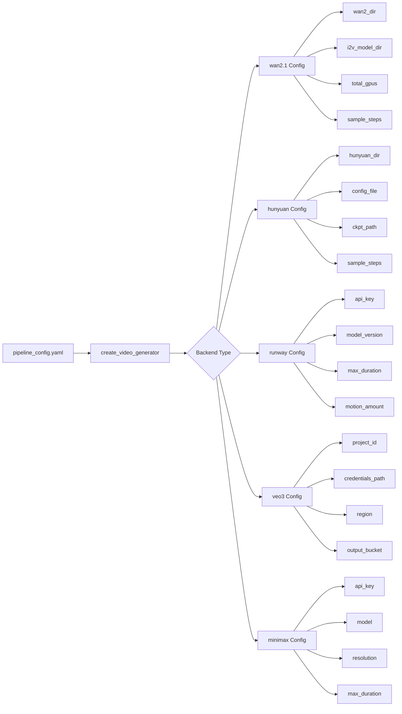
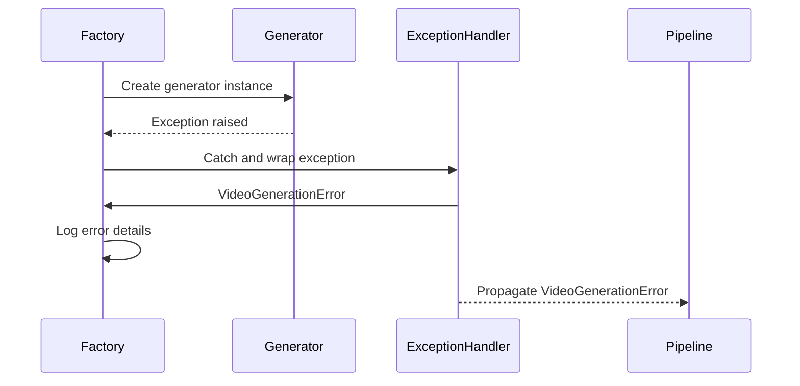

# Architecture and Interface

*Source: [DeepWiki Analysis](https://deepwiki.com/trilogy-group/ttv-pipeline/4.1-architecture-and-interface)*

This document explains the video generation backend abstraction layer, focusing on the `VideoGeneratorInterface` design, factory pattern implementation, and backend selection mechanisms. This abstraction layer enables the pipeline to support multiple video generation technologies through a unified interface.

**Key Source Files:**
- [`video_generator_interface.py`](../video_generator_interface.py) - Base interface definition
- [`generators/factory.py`](../generators/factory.py) - Factory pattern implementation

## Interface Design

The abstraction layer is built around the `VideoGeneratorInterface` abstract base class, which defines a uniform API for all video generation backends. This interface ensures that the main pipeline can work with any generator implementation without modification.

### VideoGeneratorInterface Contract

The core interface defines five essential methods that every backend must implement:

**Core Methods:**
- **`generate_video()`** → `str`: Core video generation method returning output path
- **`get_capabilities()`** → `Dict[str, Any]`: Returns backend capabilities and constraints
- **`estimate_cost()`** → `float`: Provides cost estimation for generation requests
- **`validate_inputs()`** → `List[str]`: Validates input parameters and returns error list
- **`is_available()`** → `bool`: Checks if backend is available for use

*Source: [`video_generator_interface.py`](../video_generator_interface.py)*

### Exception Hierarchy

The interface defines a comprehensive exception hierarchy for handling different types of generation failures:

**Exception Types:**
- **`VideoGenerationError`**: Base exception for all generation failures
- **`BackendUnavailableError`**: Backend is not available or properly configured
- **`InvalidInputError`**: Input parameters are invalid or unsupported
- **`QuotaExceededError`**: API quota or rate limits exceeded
- **`ModelNotFoundError`**: Required model files or versions not found

*Source: [`video_generator_interface.py`](../video_generator_interface.py)*

## Factory Pattern Implementation

The factory pattern is implemented through the `create_video_generator` function and `GENERATOR_REGISTRY`, enabling dynamic backend instantiation based on configuration.

### Generator Registry and Factory Flow

The `GENERATOR_REGISTRY` maps backend names to their corresponding generator classes:

```python
GENERATOR_REGISTRY = {
    "wan2.1": Wan21Generator,
    "runway": RunwayGenerator, 
    "veo3": Veo3Generator,
    "auto": AutoGenerator
}
```

**Factory Flow:**
1. **Registry Lookup**: Find generator class by backend name
2. **Configuration Extraction**: Extract backend-specific configuration
3. **Instance Creation**: Instantiate generator with extracted config
4. **Availability Check**: Verify backend is available for use
5. **Fallback Handling**: Try alternative backends if primary fails

*Source: [`generators/factory.py`](../generators/factory.py)*

### Configuration Extraction

The factory handles backend-specific configuration extraction, mapping general configuration parameters to each generator's expected format:

**Wan2.1 Configuration:**
- `wan2_dir`: Framework directory path
- `i2v_model_dir`: I2V model directory  
- `total_gpus`: Number of GPUs available

**Runway Configuration:**
- `runway_ml.api_key`: API authentication key
- `runway_ml.model_version`: Model version to use
- `runway_ml.max_duration`: Maximum video duration

**Veo3 Configuration:**
- `google_veo.project_id`: GCP project identifier
- `google_veo.credentials_path`: Path to GCP credentials
- `google_veo.region`: GCP region for processing

*Source: [`generators/factory.py`](../generators/factory.py)*

## Backend Registration and Selection

### Dynamic Backend Creation

The factory dynamically creates backend instances based on configuration:

```python
def create_video_generator(config: dict) -> VideoGeneratorInterface:
    backend_name = config.get('default_backend', 'auto')
    generator_class = GENERATOR_REGISTRY.get(backend_name)
    
    if not generator_class:
        raise ValueError(f"Unknown backend: {backend_name}")
    
    backend_config = extract_backend_config(config, backend_name)
    return generator_class(**backend_config)
```

### Fallback Mechanism

The system implements intelligent fallback when backends fail:

1. **Primary Backend**: Use configured `default_backend`
2. **Availability Check**: Verify backend is available and configured
3. **Automatic Fallback**: Try alternative backends in priority order
4. **Error Aggregation**: Collect and report failures from all attempts

## Configuration Management

### Backend-Specific Configuration Mapping

Each backend requires different configuration parameters, which the factory extracts and maps appropriately:



**Configuration Mapping Logic:**
- **Parameter Filtering**: Only pass relevant config to each backend
- **Default Values**: Apply sensible defaults for optional parameters
- **Validation**: Validate required parameters are present
- **Environment Variables**: Support environment variable substitution

### Remote API Settings Inheritance

Remote API backends inherit common settings while supporting backend-specific overrides:

**Common Remote Settings:**
- Authentication credentials
- Timeout and retry settings
- Progress monitoring configuration
- Error handling preferences

**Backend-Specific Overrides:**
- Model selection and parameters
- API endpoint customization
- Cost management settings
- Regional preferences

## Error Handling and Validation

### Input Validation Framework

The interface provides a standardized validation framework:

```python
def validate_inputs(self, **kwargs) -> List[str]:
    """Return list of validation errors, empty if valid"""
    errors = []
    
    # Common validation logic
    if not kwargs.get('prompt'):
        errors.append("Prompt is required")
    
    # Backend-specific validation
    errors.extend(self._validate_backend_specific(**kwargs))
    
    return errors
```

### Availability Checking

Each backend implements availability checking to ensure proper configuration:

```python
def is_available(self) -> bool:
    """Check if backend is properly configured and available"""
    try:
        # Check configuration
        if not self._check_configuration():
            return False
            
        # Test backend connectivity/models
        return self._test_availability()
    except Exception:
        return False
```

### Exception Propagation

The interface standardizes exception handling across all backends through a consistent exception flow:



This standardized approach ensures consistent error handling:

1. **Catch Backend Errors**: Backend-specific exceptions are caught and wrapped
2. **Classify Failures**: Errors are mapped to the standard exception hierarchy
3. **Preserve Context**: Original error information is maintained in the exception chain
4. **Enable Retry Logic**: Structured exceptions support intelligent retry mechanisms

## Implementation Examples

### Basic Backend Implementation

```python
class CustomGenerator(VideoGeneratorInterface):
    def __init__(self, **config):
        self.config = config
        self._initialize()
    
    def generate_video(self, prompt: str, **kwargs) -> str:
        # Implementation-specific generation logic
        output_path = self._run_generation(prompt, **kwargs)
        return output_path
    
    def get_capabilities(self) -> Dict[str, Any]:
        return {
            "max_duration": 10,
            "supported_formats": ["mp4"],
            "max_resolution": "720p"
        }
    
    def estimate_cost(self, **kwargs) -> float:
        duration = kwargs.get('duration', 5)
        return duration * 0.10  # $0.10 per second
    
    def validate_inputs(self, **kwargs) -> List[str]:
        errors = []
        if kwargs.get('duration', 0) > 10:
            errors.append("Duration cannot exceed 10 seconds")
        return errors
    
    def is_available(self) -> bool:
        return self._check_dependencies()
```

### Factory Registration

```python
# Register the custom generator
GENERATOR_REGISTRY["custom"] = CustomGenerator

# Configure in pipeline_config.yaml
default_backend: "custom"
custom:
  api_key: "${CUSTOM_API_KEY}"
  max_duration: 8
```

---

## Next Steps

- **Local Implementation**: See [Local Generators](06-local-generators.md) for GPU-based backends
- **Remote Implementation**: See [Remote API Generators](07-remote-api-generators.md) for cloud backends
- **Usage Examples**: See [Core Pipeline](03-core-pipeline.md) for integration examples
- **Configuration**: See [Getting Started](02-getting-started.md) for setup instructions
